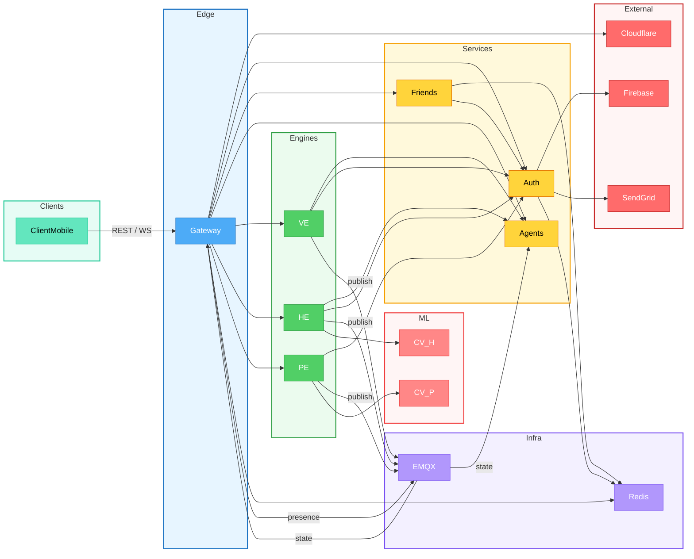

```mermaid
flowchart LR

%% ==================== CLIENTS ====================
subgraph Clients
    ClientMobile["ClientMobile"]
end

%% ==================== EDGE ====================
subgraph Edge
    Gateway["Gateway"]
end

%% ==================== SERVICES ====================
subgraph Services
    Auth["Auth"]
    Friends["Friends"]
    Agents["Agents"]
end

%% ==================== ENGINES ====================
subgraph Engines
    VE["VE"]
    HE["HE"]
    PE["PE"]
end

%% ==================== ML ====================
subgraph ML
    CV_H["CV_H"]
    CV_P["CV_P"]
end

%% ==================== INFRA ====================
subgraph Infra
    Redis["Redis"]
    EMQX["EMQX"]
end

%% ==================== EXTERNAL ====================
subgraph External
    Cloudflare["Cloudflare"]
    Firebase["Firebase"]
    SendGrid["SendGrid"]
end

%% ==================== FLOWS ====================
ClientMobile -->|REST / WS| Gateway
Gateway --> Cloudflare

Gateway --> Auth
Gateway --> Friends
Gateway --> Agents

Gateway --> VE
Gateway --> HE
Gateway --> PE

Auth --> Firebase
Auth --> SendGrid

Auth --> Redis
Gateway --> Redis
Friends --> Redis

VE --> Agents
HE --> Agents

VE --> Auth
HE --> Auth
PE --> Auth
Friends --> Auth

VE -->|publish| EMQX
HE -->|publish| EMQX
PE -->|publish| EMQX

EMQX -->|state| Gateway
EMQX -->|state| Agents

Gateway -->|presence| EMQX

HE --> CV_H
PE --> CV_P

%% ==================== NODE STYLES ====================
classDef client fill:#63e6be,stroke:#20c997,color:#000
classDef edge fill:#4dabf7,stroke:#1971c2,color:#fff
classDef service fill:#ffd43b,stroke:#e67700,color:#000
classDef engine fill:#51cf66,stroke:#2f9e44,color:#fff
classDef infra fill:#b197fc,stroke:#7950f2,color:#fff
classDef external fill:#ff6b6b,stroke:#c92a2a,color:#fff
classDef ml fill:#ff8787,stroke:#f03e3e,color:#fff

class ClientMobile client
class Gateway edge
class Auth,Friends,Agents service
class VE,HE,PE engine
class Redis,EMQX infra
class Firebase,SendGrid,Cloudflare external
class CV_H,CV_P ml

%% ==================== SUBGRAPH BACKGROUNDS ====================
style Clients fill:#e6fcf5,stroke:#20c997,stroke-width:2px
style Edge fill:#e7f5ff,stroke:#1971c2,stroke-width:2px
style Services fill:#fff9db,stroke:#f59f00,stroke-width:2px
style Engines fill:#ebfbee,stroke:#2f9e44,stroke-width:2px
style ML fill:#fff5f5,stroke:#f03e3e,stroke-width:2px
style Infra fill:#f3f0ff,stroke:#7950f2,stroke-width:2px
style External fill:#fff5f5,stroke:#c92a2a,stroke-width:2px
```