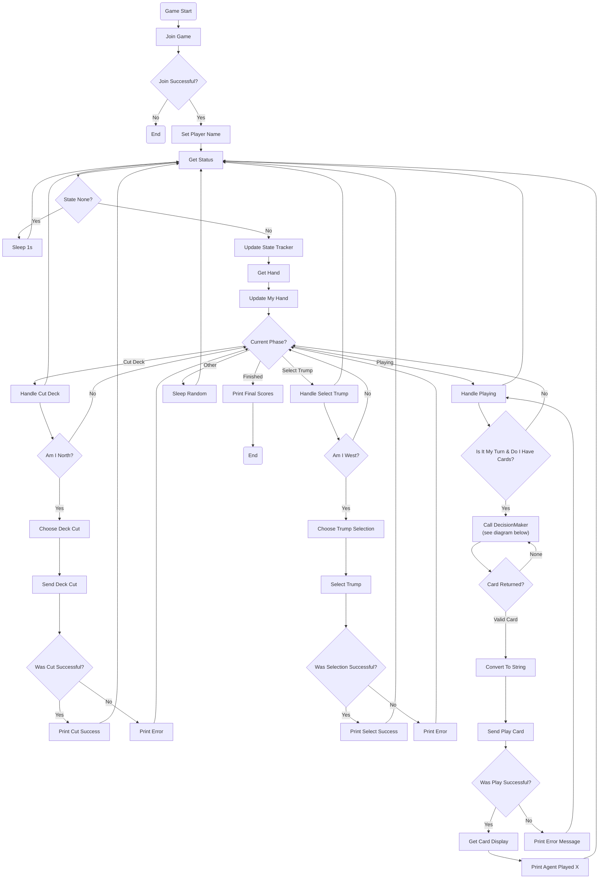
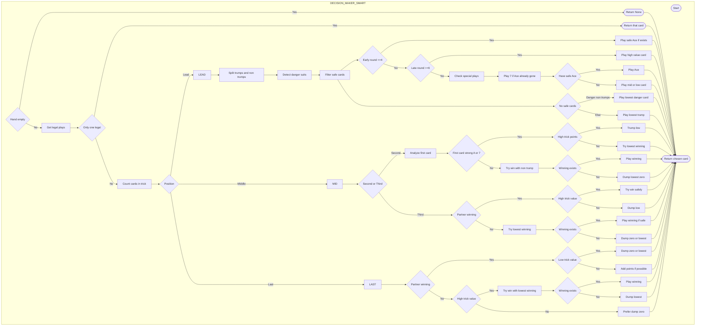

# MAIN FLUXOGRAM FOR THE OVERALL WORKFLOW OF THE SMART AGENT

```mermaid
%%{init: {'flowchart': {'nodeSpacing': 20, 'rankSpacing': 25}}}%%
flowchart TD

A(Game Start) --> B[Join Game]
B --> C{Join Successful?}
C -->|No| D(End)
C -->|Yes| E[Set Player Name]

E --> F[Get Status]
F --> G{State None?}
G -->|Yes| H[Sleep 1s]
H --> F
G -->|No| I[Update State Tracker]

I --> J[Get Hand]
J --> K[Update My Hand]
K --> L{Current Phase?}

L -->|Cut Deck| M[Handle Cut Deck]
M --> N{Am I North?}
N -->|Yes| O[Choose Deck Cut]
O --> W[Send Deck Cut]
W --> X{Was Cut Successful?}
X -->|Yes| Y[Print Cut Success]
Y --> F
X -->|No| Z[Print Error]
Z --> L
N -->|No| L

L -->|Select Trump| P[Handle Select Trump]
P --> A1{Am I West?}
A1 -->|Yes| C1[Choose Trump Selection]
A1 -->|No| L
C1 --> D1[Select Trump]
D1 --> E1{Was Selection Successful?}
E1 -->|Yes| F1[Print Select Success]
E1 -->|No| G1[Print Error]
F1 --> F
G1 --> L

L -->|Playing| R[Handle Playing]
R --> H1{Is It My Turn & Do I Have Cards?}

H1 -->|Yes| K1["Call DecisionMaker\n(see diagram below)"]
H1 -->|No| L

%% Decision Maker output (FROM second diagram conceptually)
K1 --> L1{Card Returned?}

L1 -->|None| K1
L1 -->|Valid Card| N1[Convert To String]

N1 --> O1[Send Play Card]
O1 --> P1{Was Play Successful?}
P1 -->|Yes| Q1[Get Card Display]
Q1 --> R1[Print Agent Played X]
R1 --> F
P1 -->|No| T1[Print Error Message]
T1 --> R

L -->|Finished| T[Print Final Scores]
T --> S3(End)
L -->|Other| U[Sleep Random]

M --> F
P --> F
R --> F
U --> F
```
---
## SECONDARY FLUXOGRAM WITH THE DETAILS OF CARD PICKING DECISION MAKING FOR THIS MODEL

```mermaid
%%{init: {'flowchart': {'nodeSpacing': 20, 'rankSpacing': 25}}}%%
flowchart TD

subgraph DECISION_MAKER_SMART

START([Start])

A{Hand empty}
A -->|Yes| END_NULL([Return None])
A -->|No| B[Get legal plays]

B --> C{Only one legal}
C -->|Yes| END_ONE([Return that card])
C -->|No| D[Count cards in trick]

D --> E{Position}

E -->|Lead| LEAD
E -->|Middle| MID
E -->|Last| LAST

%% =====================
%% LEAD LOGIC
%% =====================

LEAD --> L1[Split trumps and non trumps]
L1 --> L2[Detect danger suits]
L2 --> L3[Filter safe cards]

L3 --> L4{Early round <=4}
L4 -->|Yes| L5[Play safe Ace if exists]

L4 -->|No| L6{Late round >=6}
L6 -->|Yes| L7[Play high value card]

L6 -->|No| L8[Check special plays]

L8 --> L9[Play 7 if Ace already gone]
L9 --> L10{Have safe Ace}
L10 -->|Yes| L11[Play Ace]
L10 -->|No| L12[Play mid or low card]

L5 --> END
L7 --> END
L11 --> END
L12 --> END

%% fallback
L3 --> L13{No safe cards}
L13 -->|Danger non trumps| L14[Play lowest danger card]
L13 -->|Else| L15[Play lowest trump]

L14 --> END
L15 --> END

%% =====================
%% MIDDLE LOGIC
%% =====================

MID --> M1{Second or Third}

%% SECOND PLAYER
M1 -->|Second| S1[Analyze first card]
S1 --> S2{First card strong A or 7}

S2 -->|Yes| S3{High trick points}
S3 -->|Yes| S4[Trump low]
S3 -->|No| S5[Try lowest winning]

S2 -->|No| S6[Try win with non trump]

S6 --> S7{Winning exists}
S7 -->|Yes| S8[Play winning]
S7 -->|No| S9[Dump lowest zero]

S4 --> END
S5 --> END
S8 --> END
S9 --> END

%% THIRD PLAYER
M1 -->|Third| T1{Partner winning}

T1 -->|Yes| T2{High trick value}
T2 -->|Yes| T3[Try win safely]
T2 -->|No| T4[Dump low]

T1 -->|No| T5[Try lowest winning]

T5 --> T6{Winning exists}
T6 -->|Yes| T7[Play winning if safe]
T6 -->|No| T8[Dump zero or lowest]

T3 --> END
T4 --> END
T7 --> END
T8 --> END

%% =====================
%% LAST PLAYER
%% =====================

LAST --> LS1{Partner winning}

LS1 -->|Yes| LS2{Low trick value}
LS2 -->|Yes| LS3[Dump zero or lowest]
LS2 -->|No| LS4[Add points if possible]

LS1 -->|No| LS5{High trick value}
LS5 -->|Yes| LS6[Try win with lowest winning]
LS5 -->|No| LS7[Prefer dump zero]

LS6 --> LS8{Winning exists}
LS8 -->|Yes| LS9[Play winning]
LS8 -->|No| LS10[Dump lowest]

LS3 --> END
LS4 --> END
LS9 --> END
LS10 --> END
LS7 --> END

%% =====================
%% END
%% =====================

END([Return chosen card])
END_NULL --> END
END_ONE --> END

end

```
--- 

