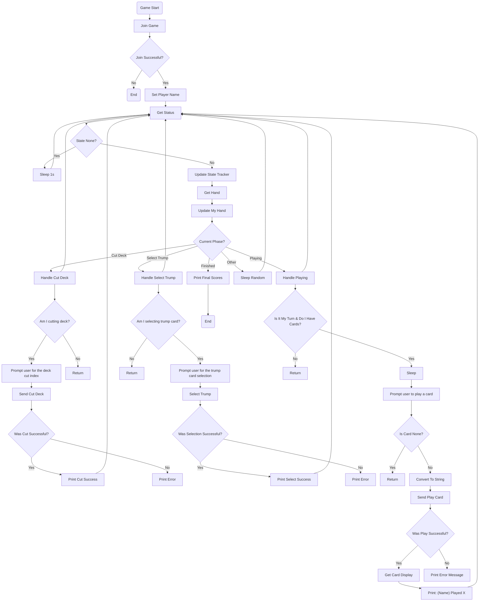

```mermaid
%%{init: {'flowchart': {'nodeSpacing': 20, 'rankSpacing': 25}}}%%
flowchart TD

A(Game Start) --> B[Join Game]
B --> C{Join Successful?}
C -->|No| D(End)
C -->|Yes| E[Set Player Name]

E --> F[Get Status]
F --> G{State None?}
G -->|Yes| H[Sleep 1s]
H --> F
G -->|No| I[Update State Tracker]

I --> J[Get Hand]
J --> K[Update My Hand]
K --> L{Current Phase?}

L -->|Cut Deck| M[Handle Cut Deck]
M -->N{Am I cutting deck?}
N -->|Yes|O[Prompt user for the deck cut index]
O -->W[Send Cut Deck]
W -->X{Was Cut Successful?}
X -->|Yes|Y[Print Cut Success]
Y --> F
X -->|No|Z[Print Error]
N -->|No|V[Return]


L -->|Select Trump| P[Handle Select Trump]
P -->A1{Am I selecting trump card?}
A1 --> |Yes|C1[Prompt user for the trump card selection]
A1 --> |No|B1[Return]
C1 --> D1[Select Trump]
D1 --> E1{Was Selection Successful?}
E1 --> |Yes| F1[Print Select Success]
F1 --> F
E1 --> |No| G1[Print Error]


L -->|Playing| R[Handle Playing]
R --> H1{Is It My Turn & Do I Have Cards?}
H1 -->|Yes| I1[Sleep]
H1 -->|No| J1[Return]
I1 --> K1[Prompt user to play a card]
K1 --> L1{Is Card None?}
L1 -->|Yes|M1[Return]
L1 -->|No|N1[Convert To String]
N1 -->O1[Send Play Card]
O1 -->P1{Was Play Successful?}
P1 -->|Yes|Q1[Get Card Display]
Q1 -->R1["Print: (Name) Played X"]
R1 -->F
P1 -->|No|T1[Print Error Message]


L -->|Finished| T[Print Final Scores]
T --> S3(End)
L -->|Other| U[Sleep Random]

M --> F
P --> F
R --> F
U --> F
```

