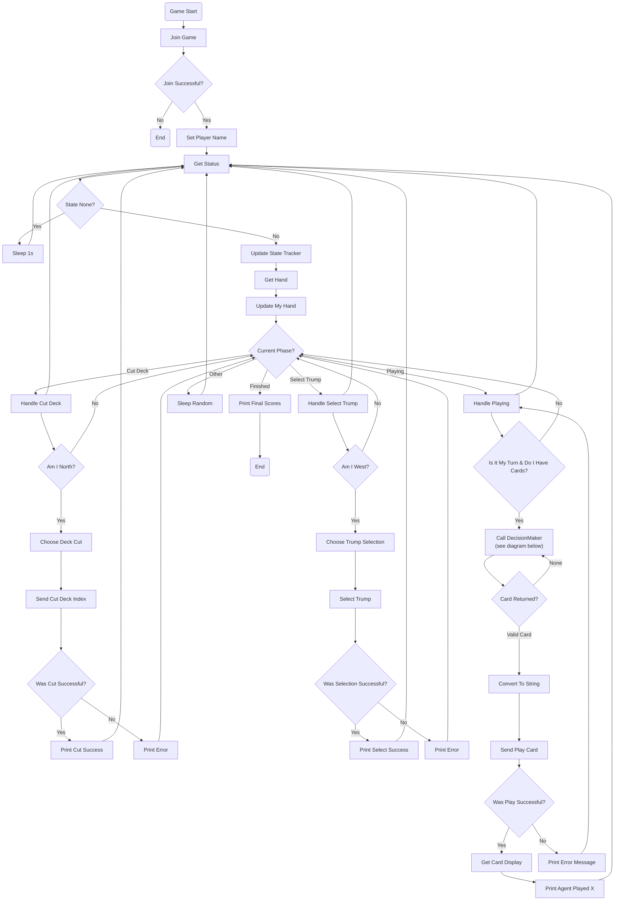

# MAIN FLUXOGRAM FOR THE OVERALL WORKFLOW OF THE RANDOM AGENT

---
## SECONDARY FLUXOGRAM WITH THE DETAILS OF CARD PICKING DECISION MAKING FOR THIS MODEL
```mermaid
flowchart TD

subgraph DECISION_MAKER_RANDOM [Random Decision Maker]

DC_START([Choose Card Called])

DC_1{Hand Empty?}
DC_1 -->|Yes| DC_NULL([Return None])
DC_1 -->|No| DC_2[Get Legal Plays]

DC_2 --> DC_3[Random Choice]

DC_3 --> DC_END([Return Selected Card])
```
---