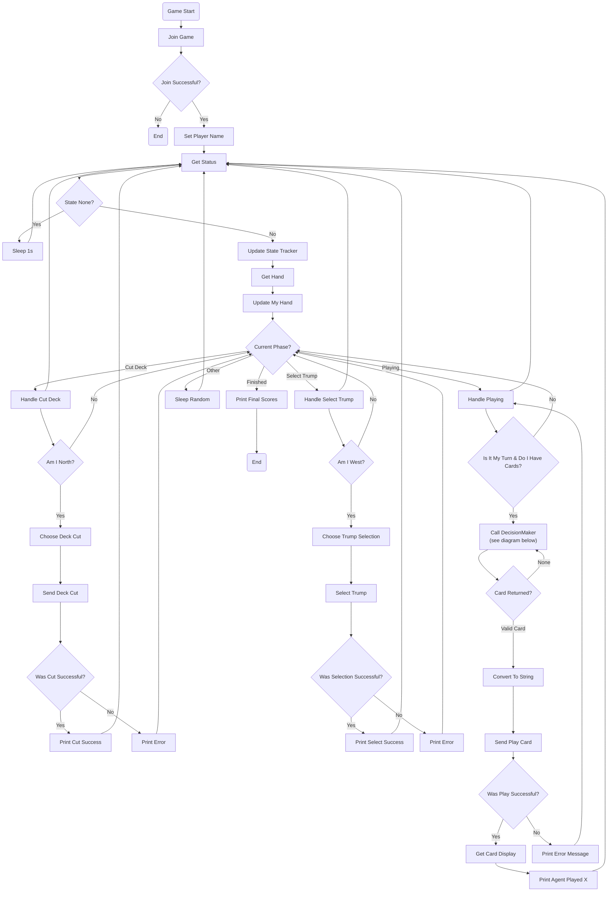

---

```mermaid
%%{init: {'flowchart': {'nodeSpacing': 20, 'rankSpacing': 25}}}%%
flowchart TD

subgraph DECISION_MAKER_SMART [Choose Card Logic]

DC_START([Start Decision])

DC_1{Hand Empty?}
DC_1 -->|Yes| DC_NULL([Return None])
DC_1 -->|No| DC_2[Get Legal Plays]

DC_2 --> DC_3{Only One Legal Play?}
DC_3 -->|Yes| DC_ONE([Return That Card])
DC_3 -->|No| DC_4[Count Cards in Trick]

DC_4 --> DC_5{Position in Trick}

DC_5 -->|Lead| DC_LEAD[Lead Logic]
DC_5 -->|Middle| DC_MIDDLE[Middle Logic]
DC_5 -->|Last| DC_LAST[Last Logic]

%% LEAD
DC_LEAD --> L1[Split Trumps / Non-Trumps]
L1 --> L2[Detect Danger Suits]
L2 --> L3[Filter Safe Cards]
L3 --> L4{Early Game?}

L4 -->|Yes| L5[Play Safe Ace]
L4 -->|No| L6{Late Game?}

L6 -->|Yes| L7[Play High Value Card]
L6 -->|No| L8[Play Medium/Low Card]

%% MIDDLE
DC_MIDDLE --> M1{Second or Third Player?}

M1 -->|Second| M2[Analyze First Card]
M2 --> M3{First Card Strong?}
M3 -->|Yes| M4[Try Win / Trump]
M3 -->|No| M5[Play Low / Safe]

M1 -->|Third| M6{Partner Winning?}
M6 -->|Yes| M7[Dump Low Card]
M6 -->|No| M8[Try Win if Safe]
M8 --> M9[Else Lowest Card]

%% LAST
DC_LAST --> LS1{Partner Winning?}

LS1 -->|Yes| LS2{High Points Trick?}
LS2 -->|Yes| LS3[Take Trick / Win]
LS2 -->|No| LS4[Dump Low]

LS1 -->|No| LS5{Can Win?}
LS5 -->|Yes| LS6[Try Win]
LS5 -->|No| LS7[Play Lowest Card]

%% RETURNS
DC_NULL --> DC_END([Return Card])
DC_ONE --> DC_END

L5 --> DC_END
L7 --> DC_END
L8 --> DC_END

M4 --> DC_END
M5 --> DC_END
M7 --> DC_END
M9 --> DC_END

LS3 --> DC_END
LS4 --> DC_END
LS6 --> DC_END
LS7 --> DC_END

```
--- 

