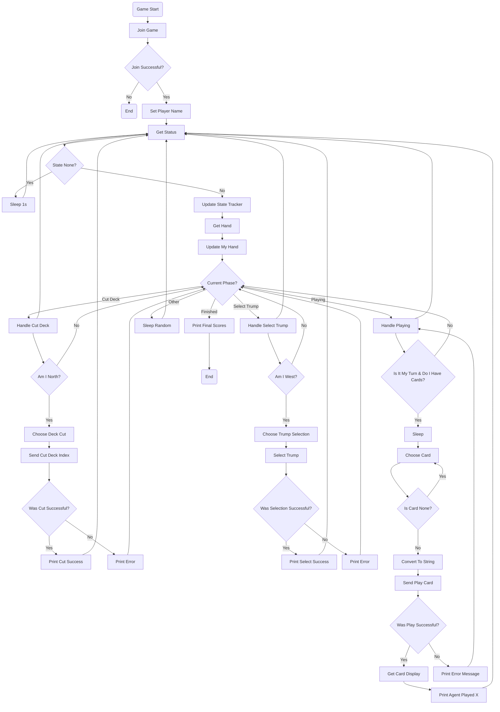
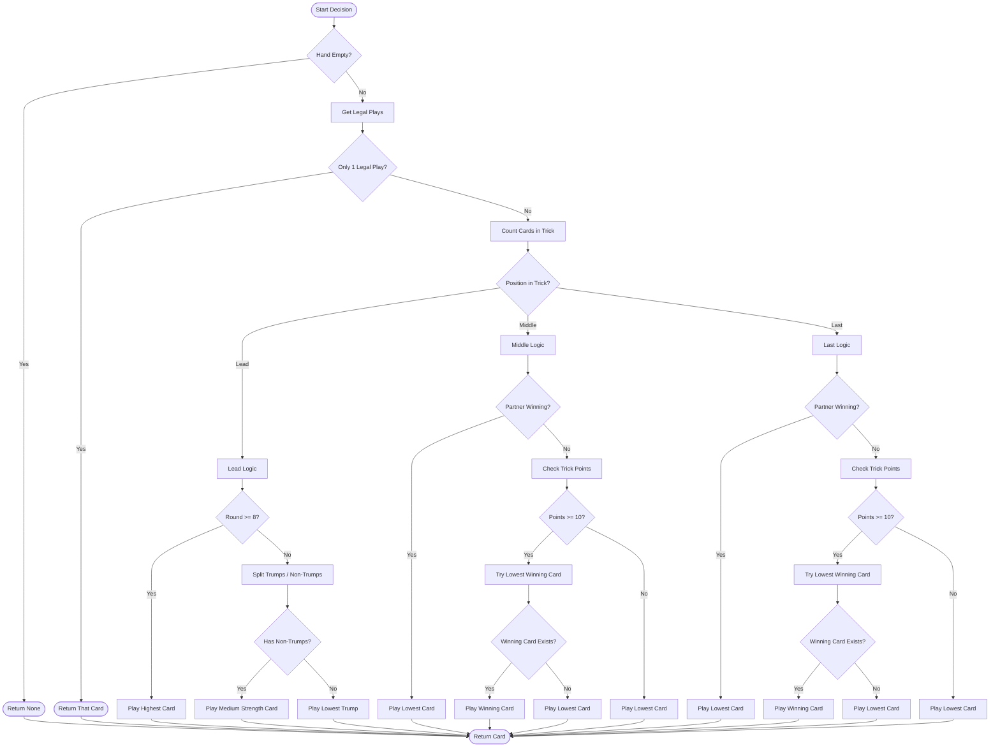

```mermaid
%%{init: {'flowchart': {'nodeSpacing': 20, 'rankSpacing': 25}}}%%
flowchart TD

A(Game Start) --> B[Join Game]
B --> C{Join Successful?}
C -->|No| D(End)
C -->|Yes| E[Set Player Name]

E --> F[Get Status]
F --> G{State None?}
G -->|Yes| H[Sleep 1s]
H --> F
G -->|No| I[Update State Tracker]

I --> J[Get Hand]
J --> K[Update My Hand]
K --> L{Current Phase?}

L -->|Cut Deck| M[Handle Cut Deck]
M -->N{Am I North?}
N -->|Yes|O[Choose Deck Cut]
O -->W[Send Cut Deck Index]
W -->X{Was Cut Successful?}
X -->|Yes|Y[Print Cut Success]
Y --> F
X -->|No|Z[Print Error]
Z -->L
N -->|No|L


L -->|Select Trump| P[Handle Select Trump]
P -->A1{Am I West?}
A1 --> |Yes|C1[Choose Trump Selection]
A1 --> |No|L
C1 --> D1[Select Trump]
D1 --> E1{Was Selection Successful?}
E1 --> |Yes| F1[Print Select Success]
F1 --> F
E1 --> |No| G1[Print Error]
G1 --> L


L -->|Playing| R[Handle Playing]
R --> H1{Is It My Turn & Do I Have Cards?}
H1 -->|Yes| I1[Sleep]
H1 -->|No| L
I1 --> K1[Choose Card]
K1 --> L1{Is Card None?}
L1 -->|Yes|K1
L1 -->|No|N1[Convert To String]
N1 -->O1[Send Play Card]
O1 -->P1{Was Play Successful?}
P1 -->|Yes|Q1[Get Card Display]
Q1 -->R1[Print Agent Played X]
R1 -->F
P1 -->|No|T1[Print Error Message]
T1 -->R


L -->|Finished| T[Print Final Scores]
T --> S3(End)
L -->|Other| U[Sleep Random]

M --> F
P --> F
R --> F
U --> F
```

---

```mermaid
%%{init: {'flowchart': {'nodeSpacing': 25, 'rankSpacing': 30}}}%%
flowchart TD

A([Start Decision]) --> B{Hand Empty?}
B -->|Yes| R0([Return None])
B -->|No| C[Get Legal Plays]

C --> D{Only 1 Legal Play?}
D -->|Yes| R1([Return That Card])
D -->|No| E[Count Cards in Trick]

E --> F{Position in Trick?}

F -->|Lead| G[Lead Logic]
F -->|Middle| H[Middle Logic]
F -->|Last| I[Last Logic]

%% ---------------- LEAD ----------------
G --> G1{Round >= 8?}

G1 -->|Yes| G2[Play Highest Card]
G1 -->|No| G3[Split Trumps / Non-Trumps]

G3 --> G4{Has Non-Trumps?}
G4 -->|Yes| G5[Play Medium Strength Card]
G4 -->|No| G6[Play Lowest Trump]

G2 --> END
G5 --> END
G6 --> END

%% ---------------- MIDDLE ----------------
H --> H1{Partner Winning?}

H1 -->|Yes| H2[Play Lowest Card]
H1 -->|No| H3[Check Trick Points]

H3 --> H4{Points >= 10?}

H4 -->|Yes| H5[Try Lowest Winning Card]
H5 --> H6{Winning Card Exists?}

H6 -->|Yes| H7[Play Winning Card]
H6 -->|No| H8[Play Lowest Card]

H4 -->|No| H9[Play Lowest Card]

H2 --> END
H7 --> END
H8 --> END
H9 --> END

%% ---------------- LAST ----------------
I --> I1{Partner Winning?}

I1 -->|Yes| I2[Play Lowest Card]
I1 -->|No| I3[Check Trick Points]

I3 --> I4{Points >= 10?}

I4 -->|Yes| I5[Try Lowest Winning Card]
I5 --> I6{Winning Card Exists?}

I6 -->|Yes| I7[Play Winning Card]
I6 -->|No| I8[Play Lowest Card]

I4 -->|No| I9[Play Lowest Card]

I2 --> END
I7 --> END
I8 --> END
I9 --> END

%% ---------------- END ----------------
END([Return Card])
R0 --> END
R1 --> END
```
--- 
