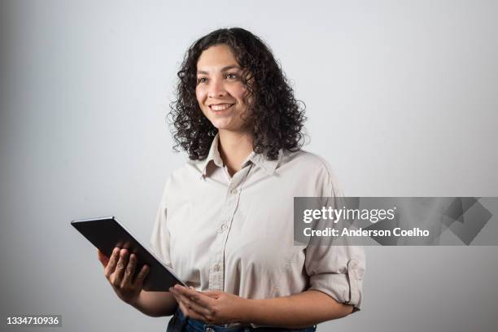

#   
**Name:** Deolinda Domingues 
**Age:** 32 
**Occupation:** Card Game Tournament & Event Organizer
**Location:** London, United Kingdom 

TODO: ADAPTAR A UMA SITUAÇÃO DE UM LAR DE IDOSOS

## Background  
Deolinda is a Portuguese woman living and working in London, drawn by the city's thriving tabletop and card gaming scene. Passionate about strategy and competition, she turned her hobby into a career by hosting and organizing events for various card games across the UK. Her experience ranges from small local meetups to large regional tournaments.

## Daily Life  
Deolinda lives her life organizing card game tournaments and events, managing all of the spaces and human resources that come with the job as well. She also really enjoys participating in some of her own friendly tournaments, wether it be getting eliminated off the bat or coming close to winning it all, she really likes it. Recently, she’s been focusing on introducing "Sueca" to the UK tournament circuit, but she’s found it difficult to find digital tools that support all her needs like managing brackets, filling last-minute absences with AI players, or tracking results in real time.

## Goals & Needs    
She needs an app that can help her manage and track a bracket's results in real time and also can work as an AI player for last minute absences in tournaments.

## Pain Points & Challenges    
The lack of existing platforms is heavy on her goals, but the bigger problem is that the need for regular subscriptions and investment for the premium version of most of them, which don't even meet her expectations and needs. 

## Motivation  
She really enjoys card games and holds "Sueca" really close to her heart, wanting to share it with the UK's thriving card game scene in a way that would be both enjoyable and well structured. 